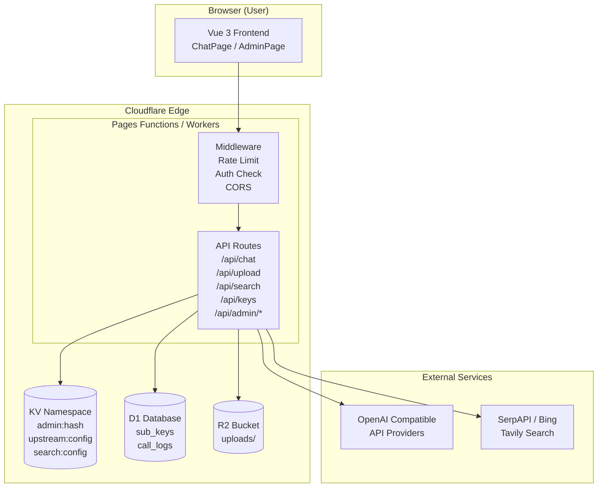

# 技术设计文档 - 云端平台 v2

Feature Name: cloud-platform-v2
Version: 1.0
Date: 2026-09-06

## 1 系统概述

前后端分离的云端 AI 对话平台，支持多模型对比、文件上传、联网搜索、管理后台。

| 层级 | 技术选型 |
|------|---------|
| 前端 | Vite 5 + Vue 3 + Vue Router + Pinia |
| 后端 | Cloudflare Workers (ES Modules) |
| 存储 | Cloudflare KV + D1 + R2 |
| 部署 | Cloudflare Pages（前端）+ Cloudflare Workers（后端 API）|
| CI/CD | GitHub Actions → Cloudflare Pages 自动部署 |

## 2 目录结构

```
ai-cloud-platform/
├── front/                          # Vue 3 前端
│   ├── public/
│   │   └── index.html
│   ├── src/
│   │   ├── main.js
│   │   ├── App.vue
│   │   ├── router/index.js
│   │   ├── stores/
│   │   │   ├── chat.js            # 对话状态
│   │   │   ├── settings.js       # 用户配置
│   │   │   └── admin.js          # 管理员状态
│   │   ├── pages/
│   │   │   ├── ChatPage.vue      # 聊天主页
│   │   │   ├── AdminLogin.vue    # 后台登录
│   │   │   ├── Dashboard.vue     # 运营统计
│   │   │   ├── UpstreamConfig.vue # 上游 API
│   │   │   ├── KeyManager.vue    # 子 Key 管理
│   │   │   ├── SearchConfig.vue  # 搜索服务配置
│   │   │   └── CallLogs.vue      # 调用日志
│   │   ├── components/
│   │   │   ├── ChatInput.vue
│   │   │   ├── MessageBubble.vue
│   │   │   ├── ModelCompare.vue  # 多模型对比区
│   │   │   ├── FileUploader.vue
│   │   │   ├── SearchToggle.vue
│   │   │   └── AdminLayout.vue
│   │   └── utils/
│   │       └── api.js             # 统一请求封装
│   ├── vite.config.js
│   ├── package.json
│   └── index.html
├── back/                           # Cloudflare Workers 后端
│   ├── src/
│   │   ├── chat.js                # /api/chat SSE 中转
│   │   ├── files.js              # /api/upload 文件上传 R2
│   │   ├── search.js             # /api/search 联网搜索
│   │   ├── subkeys.js            # /api/keys 子 Key 管理
│   │   ├── admin/
│   │   │   ├── auth.js           # /api/admin/login logout
│   │   │   ├── config.js         # /api/admin/config
│   │   │   ├── logs.js           # /api/admin/logs
│   │   │   └── stats.js          # /api/admin/stats
│   │   └── lib/
│   │       ├── kv.js              # KV 读写封装
│   │       ├── d1.js              # D1 读写封装
│   │       ├── r2.js              # R2 上传封装
│   │       ├── ratelimit.js      # 频率限制
│   │       └── auth.js            # session 验证中间件
│   ├── wrangler.toml
│   └── package.json
├── .github/
│   └── workflows/
│       ├── front-deploy.yml       # 前端构建并部署
│       └── back-deploy.yml        # Workers 部署
└── README.md
```

## 3 架构图



## 4 API 设计

### 4.1 用户 API

| 端点 | 方法 | 描述 |
|------|------|------|
| `/api/chat` | POST | 对话中转（流式 SSE）|
| `/api/upload` | POST | 文件上传到 R2，返回访问 URL |
| `/api/search` | POST | 联网搜索，返回前 5 条结果 |
| `/api/keys/apply` | POST | 申请子 Key |
| `/api/keys/status` | GET | 查询当前子 Key 配额 |
| `/api/keys` | GET | 获取当前用户的 Key 信息 |
| `/api/keys` | DELETE | 注销当前用户的 Key |

### 4.2 管理员 API（需 session cookie）

| 端点 | 方法 | 描述 |
|------|------|------|
| `/api/admin/init` | POST | 首次设置管理员密码 |
| `/api/admin/login` | POST | 登录验证 |
| `/api/admin/logout` | POST | 登出 |
| `/api/admin/check` | GET | 检查登录状态 |
| `/api/admin/config` | GET/POST | 获取/更新上游 API 配置 |
| `/api/admin/search` | GET/POST | 获取/更新搜索服务配置 |
| `/api/admin/keys` | GET/POST/DELETE | 管理所有子 Key |
| `/api/admin/logs` | GET | 分页查询调用日志 |
| `/api/admin/stats` | GET | 运营统计数据 |

### 4.3 Chat API 详细设计

**请求体：**
```json
{
  "messages": [
    { "role": "system", "content": "..." },
    { "role": "user", "content": "..." }
  ],
  "model": "deepseek-chat",
  "files": ["https://xxx.r2.dev/uploads/abc.png"],
  "search": true
}
```

**响应：** SSE 流式，逐 token 增量返回，同 Model Compare 场景时一次返回多个模型的 delta。

**多模型对比响应格式：**
```
event: model-1
data: {"id":"...","model":"deepseek-chat","choices":[{"delta":{"content":"..."}}]}

event: model-2
data: {"id":"...","model":"qwen-max","choices":[{"delta":{"content":"..."}}]}

event: done-model-1
data: {"id":"..."}

event: done-model-2
data: {"id":"..."}
```

前端根据 `event` 字段分发到对应模型的渲染区。

## 5 数据模型

### 5.1 KV Keys

| Key | 类型 | 描述 |
|-----|------|------|
| `admin:hash` | string | bcrypt 哈希后的管理员密码 |
| `admin:session:{token}` | string | session 对象 JSON，过期时间戳 |
| `upstream:primary` | object | 主上游 API 配置 |
| `upstream:backup` | object | 备用上游 API 配置 |
| `search:config` | object | 搜索服务配置 |

**upstream object 结构：**
```json
{
  "baseUrl": "https://api.deepseek.com/v1",
  "apiKey": "sk-...",
  "models": ["deepseek-chat", "deepseek-reasoner"],
  "defaultModel": "deepseek-chat",
  "maxConcurrency": 5,
  "enabled": true
}
```

### 5.2 D1 Tables

**sub_keys 表：**
```sql
CREATE TABLE sub_keys (
  id TEXT PRIMARY KEY,
  key_hash TEXT NOT NULL UNIQUE,
  user_ip TEXT,
  created_at INTEGER NOT NULL,
  calls_daily INTEGER DEFAULT 0,
  tokens_daily INTEGER DEFAULT 0,
  calls_limit INTEGER DEFAULT 100,
  tokens_limit INTEGER DEFAULT 100000,
  last_reset_date TEXT,
  disabled INTEGER DEFAULT 0
);
```

**call_logs 表：**
```sql
CREATE TABLE call_logs (
  id INTEGER PRIMARY KEY AUTOINCREMENT,
  sub_key_id TEXT,
  model TEXT,
  prompt_tokens INTEGER,
  completion_tokens INTEGER,
  total_tokens INTEGER,
  latency_ms INTEGER,
  error TEXT,
  created_at INTEGER NOT NULL
);
CREATE INDEX idx_logs_date ON call_logs(created_at);
CREATE INDEX idx_logs_subkey ON call_logs(sub_key_id);
```

### 5.3 R2 对象

| 路径 | 描述 |
|------|------|
| `uploads/{uuid}.{ext}` | 用户上传的文件 |
| Cache: `public, max-age=86400` | 公开可访问，24h 缓存 |

## 6 核心流程

### 6.1 对话流程（含联网搜索）

```
用户发送消息
  │
  ├─ 开启联网搜索？
  │   ├─ 是 → search.js 调第三方搜索 API
  │   │        取前 5 条结果，拼成上下文
  │   └─ 否 → 跳过
  │
  ├─ 注入文件内容（如有 PDF/图片 URL）
  │
  └─ 发送给 /api/chat
        ├─ 验证 session（可选，用户端匿名可跳过）
        ├─ 从 KV 读 upstream config
        ├─ 并发调用上游多个模型（若开启对比）
        ├─ 流式回传 SSE
        └─ 写入 call_logs（D1）
```

### 6.2 文件上传流程

```
用户选择文件
  │
  ├─ 前端校验：MIME type + 文件大小 < 25MB
  │
  └─ POST /api/upload (multipart/form-data)
        ├─ 服务端二次校验 MIME type
        ├─ 生成 UUID 文件名
        ├─ 上传到 R2（public bucket）
        ├─ 返回 { url, filename, size, mimeType }
        └─ 前端显示预览 + 插入 messages
```

### 6.3 子 Key 申请流程

```
用户点击"申请 API Key"
  │
  └─ POST /api/keys/apply
        ├─ 检查 KV 是否配置了全局中转 API
        ├─ 生成 sk-user-{uuid} 和其哈希
        ├─ 写入 D1 sub_keys（默认配额）
        └─ 返回 sk-user-{uuid}（明文，仅此时展示一次）
```

### 6.4 管理员登录流程

```
首次访问 /admin
  │
  ├─ GET /api/admin/check
  │   └─ 返回 { initialized: false } → 显示初始化页
  │
  └─ POST /api/admin/init { password }
        ├─ bcrypt 哈希密码
        └─ 写入 KV admin:hash

后续访问 /admin
  │
  ├─ GET /api/admin/check
  │   └─ 返回 { initialized: true, loggedIn: false } → 显示登录页
  │
  └─ POST /api/admin/login { password }
        ├─ 读取 KV admin:hash，比对 bcrypt
        ├─ 防暴力：IP 计数，超过 5 次返回 429
        ├─ 成功 → 生成 session token，写入 KV
        └─ 返回 session cookie（HttpOnly）
```

## 7 多模型对比实现

### 前端 ModelCompare 组件

```vue
<template>
  <div class="compare-grid" :style="{ gridTemplateColumns: `repeat(${models.length}, 1fr)` }">
    <div v-for="model in models" :key="model">
      <div class="model-header">{{ model }}</div>
      <div class="model-body" :id="`mb-${model}`">
        <!-- 流式渲染区 -->
      </div>
    </div>
  </div>
</template>
```

### 后端并发调用

```javascript
// 并发发往 N 个模型
const results = await Promise.allSettled(
  models.map(model =>
    fetchUpstream(model, messages, apiKey)
  )
);
results.forEach((result, i) => {
  if (result.status === 'fulfilled') {
    // 管道化流式转发 event: model-{i}
  }
});
```

## 8 路由与权限

| 前端路由 | 后端中间件 |
|---------|----------|
| `/` | 无限制 |
| `/api/*` (用户端) | 无限制 |
| `/api/admin/*` | `requireAdminSession` |

中间件返回 401 时前端跳转 `/admin` 登录页。

## 9 环境变量

| 变量 | 位置 | 描述 |
|------|------|------|
| `UPSTREAM_CONFIG` | Workers 变量 | KV 替代，不依赖 wrangler |
| `R2_BUCKET` | Workers 变量 | R2 bucket 名 |
| `D1_DATABASE` | Workers 变量 | D1 database UUID |
| `ADMIN_HASH` | Workers 变量 | KV 中的 admin hash key 名 |
| `CLOUDFLARE_ACCOUNT_ID` | GitHub Secrets | Workers 部署用 |
| `CLOUDFLARE_API_TOKEN` | GitHub Secrets | Workers 部署用 |

## 10 部署流程

### 前端部署（GitHub Actions）

1. push 到 `main` 分支
2. `npm install && npm run build`
3. `wrangler pages deploy dist/`

### 后端部署（GitHub Actions）

1. push 到 `main` 分支
2. `wrangler deploy --env production`
3. 将 Worker URL 填入 Pages 的环境变量 `API_BASE_URL`

## 11 错误处理策略

| 场景 | 处理 |
|------|------|
| 上游 API 429 | 返回 429，提示"上游配额用尽" |
| 上游 API 500/502/503 | 返回 502，提示"上游服务异常" |
| 搜索 API 超时 | 跳过搜索部分，继续对话，返回警告"联网搜索暂不可用" |
| 文件上传 MIME 不符 | 返回 400 |
| 子 Key 配额用尽 | 返回 429 "配额用尽" |
| 暴力破解 admin | 返回 429，IP 封锁 15 分钟 |
| KV / D1 / R2 异常 | 返回 503 |

## 12 实现步骤

### Phase 1：项目脚手架（基础）
1. 创建独立仓库 `ai-cloud-platform`
2. 初始化前端 Vite + Vue 3 项目
3. 初始化后端 Cloudflare Workers 项目
4. 配置 GitHub Actions 部署流程
5. 部署空的 shell 项目，验证 CI/CD 链路

### Phase 2：核心聊天（无文件/无搜索）
6. 实现 `/api/chat` SSE 中转
7. 前端 ChatPage 基础 UI（输入/输出/流式）
8. 多模型并发调用（ModelCompare）
9. 基础会话管理（Pinia store）

### Phase 3：文件上传
10. 实现 `/api/upload` R2 上传
11. FileUploader 组件（拖拽/预览/进度）
12. 前端文件注入 messages

### Phase 4：联网搜索
13. 实现 `/api/search`（Tavily / SerpAPI / Bing）
14. SearchToggle 组件
15. 搜索结果注入 prompt

### Phase 5：子 Key 与配额
16. D1 表初始化（sub_keys, call_logs）
17. 子 Key 申请/查询/注销 API
18. 前端个人 API Key 面板
19. 配额写入 call_logs

### Phase 6：管理后台
20. Admin 登录/初始化（bcrypt + session）
21. 上游 API 配置页面
22. 搜索服务配置页面
23. 子 Key 管理页面（列表/禁用/删除）
24. 调用日志页面（分页/筛选）
25. 运营统计面板（Chart.js）

### Phase 7：收尾
26. 安全审计（路径穿越/MIME 校验/日志脱敏）
27. 性能优化（R2 CDN headers/并发数限制）
28. 文档更新 README
29. 删除 app 仓库中的 cloudflare/ 目录
